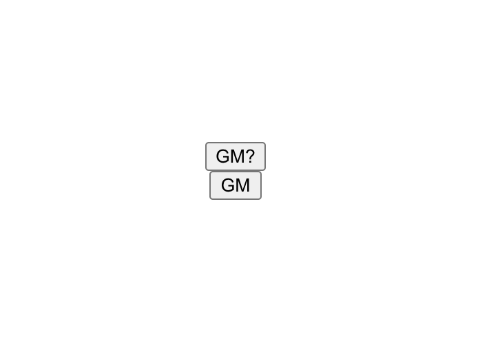

# GM Website Full-Stack Solidity Smart Contract Demo

This project showcases how to:
1. Write a Solidity smart contract
2. Create a Hardhat deploy script
3. Deploy to Rinkeby testnet using Alchemy
4. Build a simple React frontend website that reads and writes to the Ethereum blockchain using the smart contract functions

## Get started in 10 minutes or less.
0. Set up  and  accounts.
- Set up an Alchemy app on the Rinkeby test network.
- Enable MetaMask testnets view: 

1. Use `npm init` to install dependencies.

2. Create a `.env` file and add these definitions:

```
ALCHEMY_RINKEBY_URL=https://eth-rinkeby.alchemyapi.io/v2/<your api key>
ALCHEMY_RINKEBY_API_KEY=<your api key>
PRIVATE_KEY=<your ethereum wallet private key>
CONTRACT_ADDRESS_RINKEBY=<your contract address after deploying to rinkeby>
ETHERSCAN_API_KEY=<your etherscan api key>

REACT_APP_ALCHEMY_API_KEY=<your api key>
REACT_APP_PRIVATE_KEY=<your ethereum wallet private key>
REACT_APP_CONTRACT_ADDRESS=<your contract address after deploying to rinkeby>
```

3. (Optional) Tweak the smart contract in `./contracts/Greeter.sol` to your liking.

4. Get some Rinkeby testnet Ether. You can use what's called a faucet to get free
   testnet Ether. This is like getting some fake play money so that you can test your
   contract in a staging environment.

   Here are some faucets:
   - Chainlink Faucet: https://faucets.chain.link/rinkeby
   - Paradigm Faucet: https://faucet.paradigm.xyz/
   - Ethereum Foundation Rinkeby Faucet: https://faucet.rinkeby.io/

   Faucets are notoriously hard to keep up and running, so if you have trouble getting
   some, feel free to tweet  or
   ask around in the . Be sure
   to mention this repo!

5. Deploy your contract to the Rinkeby testnet.

- Use `npx hardhat run scripts/sample-script.js --network rinkeby`
- After deploying, you should see something like this in your terminal:

```
thatguyintech@albert bloop % npx hardhat run scripts/sample-script.js --network rinkeby
Greeter deployed to: 0x58e4897E480FCE04585396250E4eDE4c67691cC4
current gm value:  true
current gm value:  true
```

- Grab that address tring `0x58e4897E480FCE04585396250E4eDE4c67691cC4` and plug that into
  your `.env` file for the `CONTRACT_ADDRESS_RINKEBY` and `REACT_APP_CONTRACT_ADDRESS` fields.

6. Copy the contract abi into the react app folder.
- `cp -r ./artifacts ./src`

7. Use `npm start` to load the website.

This is what the site will look like in gm mode:


This is what the site will look like in gn mode: 


## What is Alchemy?

https://www.alchemy.com/

When reading and writing to the blockchain, you need to gain access via a node. Nodes
are servers (aka computers) that are running the Ethereum blockchain software. Setting
up one of these nodes on your own is very costly -- it can take days to sync and verify
all the historical data, and there is lots of maintenance and energy required if you
want to scale the number of transactions your node is handling.

Fortunately, that's where Alchemy comes in. Easy, out-of-the-box supernode infrastructure
right at your fingertips. Literally click a few buttons and you're ready to deploy
your app!

## What is MetaMask?

https://metamask.io

MetaMask is the most popular browser-based cryptocurrency and blockchain wallet.
Basically, it's your gateway into the Ethereum blockchain. You can use it as a
browser extension to manage your crypto assets, test applications on Ethereum
testnets, buy and sell NFTs, etc. 

## What is Hardhat?

https://hardhat.org/

Hardhat is an Ethereum development environment. It allows you to compile, deploy,
and test your Solidity smart contracts locally and then push to production as
well. There are tons of plugins that help with debugging and testing.

## What is Ethers.js?

https://docs.ethers.io/v5/

Ethers.js is a library of functions that makes it easy for you to interact
with the Ethereum blockchain when writing frontend code. In this project we use
Ethers to load a contract ABI and call its functions when the user clicks on
the GM buttons.
